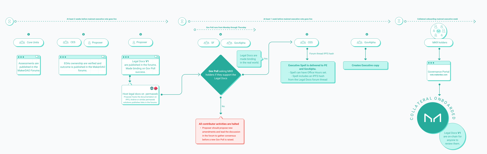
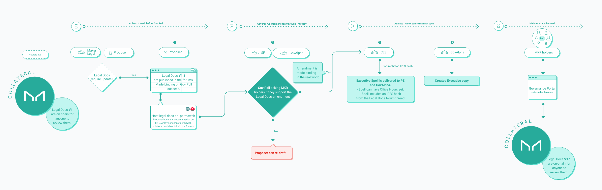

# RWA Legal Documentation Operations Guide

Real World Assets (RWAs) are a collateral type in the Maker Protocol which require legal entities to represent the MakerDAO in order to interact with "real world" counterparties in deals ratified by governance.

For transparency purposes, under the open source ethos, MakerDAO publishes and requires counterparties to publish in the [Maker forums](https://forum.makerdao.com/) any legal document defining the deal, transaction details and reporting.

Managing legal agreements drafting process with the counterparty and publication of final binding agreements is a process that is defined in this guide with the aim to help counterparties understand how to approach this task during initial collateral onboarding and later amendments required by the counterparty or the MakerDAO community and token holders during the deal life cycle.

There are two legal processes; [Legal Process for Collateral Onboarding,](rwa-legal-documentation-operations-guide.md#process-for-managing-legal-documentation-for-collateral-onboarding) and [Legal Process for Amending and Managing Existing Collaterals](rwa-legal-documentation-operations-guide.md#process-for-amending-legal-documentation-for-deployed-vaults).

## Process for Managing Legal Documentation for Collateral Onboarding

### Situation

* The collateral application is a self-contained MIP or a MIP6 application published by a proposer in the MakerDAO forums.
* The application is worked on by the relevant core units: Strategic Finance and Collateral Engineering Services.&#x20;

### Process

* Legal documentation is prepared in advance of any Maker Governance vote, and made binding using a Governance Poll, that states that MakerDAO commits to publish the Executive Vote in a specified time frame, e.g. 30 days. This time frame gives a clear commitment to the MIP proposer on when the funds will be made available and also gives MakerDAO Core Units the flexibility to organize the Executive Votes in accordance to operational and security criteria.
* Sample wording:

> **Other than this section and sections \[cross-reference confidentiality], \[cross-reference governing law], \[cross-reference disputes] and \[cross-reference miscellaneous] \[cross-reference any other sections which the parties may consider appropriate], which shall be binding on the parties upon execution of this Agreement, the other provisions of this Agreement and each other financing agreement shall only become binding and effective on the parties \[thirty (30)] days after the affirmative approval of Maker token holders of the transactions contemplated by this Agreement and the other financing agreements, as evidence under the tab “Polling” at vote.makerdao.com**

#### Steps

<figure><figcaption>
Process for legal documentation management during Collateral Onboarding
</figcaption></figure>

| # | Who        | When                                               | What                                                                                                                                                                                                                                                                                                                                                                                                                                                                                                                                                                                                                                                                                                                                                                                                                                                                                                                                                                                                                                                                                                                                                                                                                                                                                                                                                                                                             |
| - | ---------- | -------------------------------------------------- | ---------------------------------------------------------------------------------------------------------------------------------------------------------------------------------------------------------------------------------------------------------------------------------------------------------------------------------------------------------------------------------------------------------------------------------------------------------------------------------------------------------------------------------------------------------------------------------------------------------------------------------------------------------------------------------------------------------------------------------------------------------------------------------------------------------------------------------------------------------------------------------------------------------------------------------------------------------------------------------------------------------------------------------------------------------------------------------------------------------------------------------------------------------------------------------------------------------------------------------------------------------------------------------------------------------------------------------------------------------------------------------------------------------------- |
| 1 | Core Units | At least 2 week before the mainnet Executive Vote. | All assessments (legal, counterparty risk, credit risk, technical risk) are published in the forum adding the `ilk` name or MIP number to the forum posts as tag, e.g. RWA-007, MIP99.                                                                                                                                                                                                                                                                                                                                                                                                                                                                                                                                                                                                                                                                                                                                                                                                                                                                                                                                                                                                                                                                                                                                                                                                                           |
| 2 | CES        | At least 2 week before the mainnet Executive Vote. | 
All externally owned accounts (EOA) or multi-signature wallets that are authorized to operate the RWA vault must be verified for ownership, either by message signature or by transferring funds verification methods. 

1) By message signature: 
<ul><li>CES defines a message to sign, e.g. <code>RWA_007_OPERATOR</code> </li><li>Message signed should be published by the MIP proposer in the Technical Assessment forum thread. The MIP proposer must use the same username as the one used in the MIP forum thread that got ratified (<a href="https://forum.makerdao.com/t/rwa007-mip65-monetalis-clydesdale-ces-domain-team-assessment/17787/4?u=m_c">example</a>). </li><li>CES will verify the signature and publish a response in the same forum thread. </li></ul>
2) By transferring funds: 
<ul><li>A member from the proposer team (normally a trustee) with access to a crypto broker account will share the account address which needs to be verified. A screen sharing session with a Core Unit member to verify the address shared will be needed. </li><li>A Core Unit member (from CES normally) will send a small amount of tokens to the address. </li><li>The proposer member having access to the address will send the tokens back. </li><li>CES will publish in the Technical Assessment forum thread the transaction IDs and links to a block explorer.</li></ul> |
| 3 | Proposer   | At least 2 week before the mainnet Executive Vote. | 
A new forum thread is published with the tile “MIPXX: Transaction Documents” or “MIP6: [Collateral Name from the <a href="https://docs.google.com/spreadsheets/d/1PDf_CzhGa7mLuOUfX6Bz3WrnCjDRhIjmu-vDZMMw4Qc/edit#gid=1077340672">CSI</a>]: Transaction Documents” containing all contracts, agreements, resolutions that rule the deal in the real world.
<ul><li>Documents that require signatures, must already be signed. </li><li>The documents should be drafted in such a way that they are pre-signed, awaiting for successful Governance Poll to make them binding. The documents state that MakerDAO commits to publish the Executive Spell within a specific time frame, e.g. 30 days. </li><li>The PDF versions should be uploaded to Ardrive or <a href="https://ipfs.tech/">IPFS</a> (using a pinning service such as <a href="https://www.pinata.cloud/">Pinata</a> ) </li><li>The forum post should be tagged with the <code>ilk</code> name (CES can provide such) or MIP number as tag, e.g. RWA-007, MIP99.</li></ul>                                                                                                                                                                                                                                                                                                                                                                  |
| 4 | GovAlpha   | At least 1 week before the mainnet Executive Vote. | <ul><li>A Governance Poll is posted which links to all legal agreements for the proposed collateral asking MKR token holders to make the legal documents binding by voting YES.</li></ul>                                                                                                                                                                                                                                                                                                                                                                                                                                                                                                                                                                                                                                                                                                                                                                                                                                                                                                                                                                                                                                                                                                                                                                                                                        |
| 5 | CES        | At least 1 week before the mainnet Executive Vote. | <ul><li>The “Transaction Documents” forum thread is uploaded to IPFS using a pinning service and the hash is included in the <code>RWA_00X_DOC</code> variable in the onboarding spell. </li><li>All mainnet smart contract addresses are published in the Technical Assessment forum thread. </li><li>CES sets “office hours” for the mainnet spell which means the spell is cast between 14H-21H UTC Monday through Friday only.</li></ul>                                                                                                                                                                                                                                                                                                                                                                                                                                                                                                                                                                                                                                                                                                                                                                                                                                                                                                                                                                     |
| 6 | GovAlpha   | At least 1 week before the mainnet Executive Vote. | <ul><li>GovAlpha creates an Executive Vote copy which displayed on the voting portal in the "<a href="https://vote.makerdao.com/executive">Executive</a>" tab</li></ul>                                                                                                                                                                                                                                                                                                                                                                                                                                                                                                                                                                                                                                                                                                                                                                                                                                                                                                                                                                                                                                                                                                                                                                                                                                          |

### Determining Governance Poll outcome

* There are now 2 independent systems doing the same calculation for Governance Poll outcome, if there is a bug in one of the systems, another can be used to define the correct outcome while the bug is acknowledged and solved.
  * System 1: [https://vote.makerdao.com/polling](https://vote.makerdao.com/polling)
  * System 2: [https://tracker-gov.makerdao.network](https://tracker-gov.makerdao.network/)&#x20;

## Process for Amending Legal Documentation for Deployed Vaults

### Situation

* A RWA deal is live with a deployed vault.&#x20;
* An amendment on the legal agreements is needed, either triggered by MakerDAO or by the counterparty.

### Process

* Legal documentation is prepared in advance of any Maker Governance vote, and made binding using a Governance Poll.
  * If the amendment requires a change in the protocol (such as raising debt ceiling or modifying the stability fee), wording stating that MakerDAO commits to publish the Executive Vote in a specified time frame, e.g. 30 days should be included in the legal documentation amendment. The Executive Vote is where the actual change in the protocol is executed.&#x20;
  * If no change in the protocol is needed, MakerDAO will at its own discretion, update the `RWA_00X_DOC` variable to the specific vault in order to include the amendment for transparency purposes only. This refers to the [steps 3 and 4](rwa-legal-documentation-operations-guide.md#undefined) in the table below.
* A Governance Poll will be published which, if successful, will make the docs binding.&#x20;
* Sample wording:&#x20;

> **Other than this section and sections \[cross-reference governing law], \[cross-reference disputes] and \[cross-reference miscellaneous] \[cross-reference any other sections which the parties may consider appropriate], which shall be binding on the parties upon execution of this Amendment, the other provisions of this Amendment shall only become binding and effective on the parties \[thirty (30)] days after the affirmative approval of Maker token holders of the transactions contemplated by this Amendment, as evidence under the tab “Polling” at vote.makerdao.com**

#### Steps

<figure><figcaption>
Process for amending legal documentation for an existing RWA vault
</figcaption></figure>

| # | Who             | When                                               | What                                                                                                                                                                                                                                                                                                                                                                                                                    |
| - | --------------- | -------------------------------------------------- | ----------------------------------------------------------------------------------------------------------------------------------------------------------------------------------------------------------------------------------------------------------------------------------------------------------------------------------------------------------------------------------------------------------------------- |
| 1 | Proposer        | At least 1 week before the Governance Poll.        | Publish amended legal documents in the existing “Transaction Documents” forum thread (documents should be hosted on [IPFS](https://ipfs.tech/)/[Ardrive](https://ardrive.io/)) for the specific `Ilk` and handover Gov Poll copy to GovAlpha and SF CUs by Friday latest.                                                                                                                                               |
| 2 | GovAlpha and SF | Governance Poll week.                              | Publish agreed copy and Governance Poll on Monday. Governance Poll will be live until THU at 16H UTC.                                                                                                                                                                                                                                                                                                                   |
| 3 | CES/PE          | At least 1 week before the mainnet Executive Vote. | <ul><li>The “Transaction Documents” forum thread (RAW version) is uploaded to IPFS using a pinning service and the hash is included in the <code>RWA_00X_DOC</code> variable in the onboarding spell. </li><li>(Optional) Set “office hours” for the mainnet spell which means the spell is cast between 14H-21H UTC Monday through Friday only. </li><li>(Optional) Include ilk parameter changes as needed.</li></ul> |
| 4 | GovAlpha        | At least 1 week before the mainnet Executive Vote. | <ul><li>GovAlpha creates an Executive Vote copy which displayed on the voting portal.</li></ul>                                                                                                                                                                                                                                                                                                                         |

### Determining Governance Poll Outcome

* There are now 2 independent systems doing the same calculation for Gov Poll outcome, if there is a bug in one of the systems, another can be used to define the correct outcome while the bug is acknowledged and solved.
  * System 1: [https://vote.makerdao.com/polling](https://vote.makerdao.com/polling)
  * System 2: [https://tracker-gov.makerdao.network](https://tracker-gov.makerdao.network/)&#x20;
